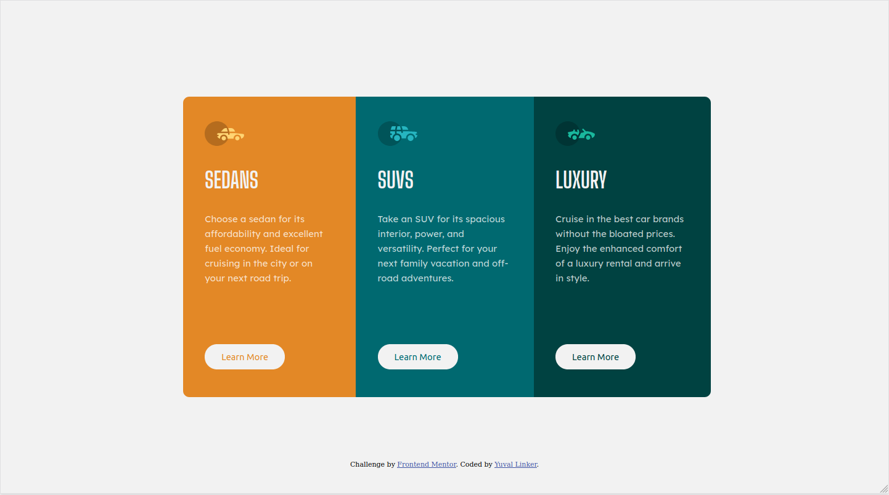

# Frontend Mentor - 3-column preview card component solution

This is a solution to the [3-column preview card component challenge on Frontend Mentor](https://www.frontendmentor.io/challenges/3column-preview-card-component-pH92eAR2-). Frontend Mentor challenges help you improve your coding skills by building realistic projects. 

## Table of contents

- [Frontend Mentor - 3-column preview card component solution](#frontend-mentor---3-column-preview-card-component-solution)
  - [Table of contents](#table-of-contents)
  - [Overview](#overview)
    - [The challenge](#the-challenge)
    - [Screenshot](#screenshot)
    - [Links](#links)
  - [My process](#my-process)
    - [Built with](#built-with)
    - [What I learned](#what-i-learned)
    - [Continued development](#continued-development)
  - [Author](#author)

## Overview

### The challenge

Users should be able to:

- View the optimal layout depending on their device's screen size
- See hover states for interactive elements

### Screenshot

First the mobile design (375px X 1502px):

And the desktop design (1440px X 804px):

### Links

- Solution and Live Site URL: [Github Pages](https://yuval-linker.github.io/3-column-card-challenge/)

## My process

### Built with

- Semantic HTML5 markup
- CSS custom properties
- Flexbox
- Mobile-first workflow

### What I learned

I learned about SVGs and how to use them. Also i improved in reutilizing different classes and distributing them well.

On another hand, i investigated about mobile first desing and i think this time i followed it by using `@media` with `min-screen` instead of `max-width`. This should improve performance on mobile devices.

### Continued development

I really want to perfect my responsive design. I think that, although my design fullfills the requirements, there are still flaws when changing the size of the device.

Also, you can never stop learning about flex and the things you can do. The most difficult thing for me in CSS is deciding on measures, like rem, percentages or pixels.

## Author

- Website - [Yuval Linker](https://github.com/yuval-linker)
- Frontend Mentor - [@yuval-linker](https://www.frontendmentor.io/profile/yuval-linker)